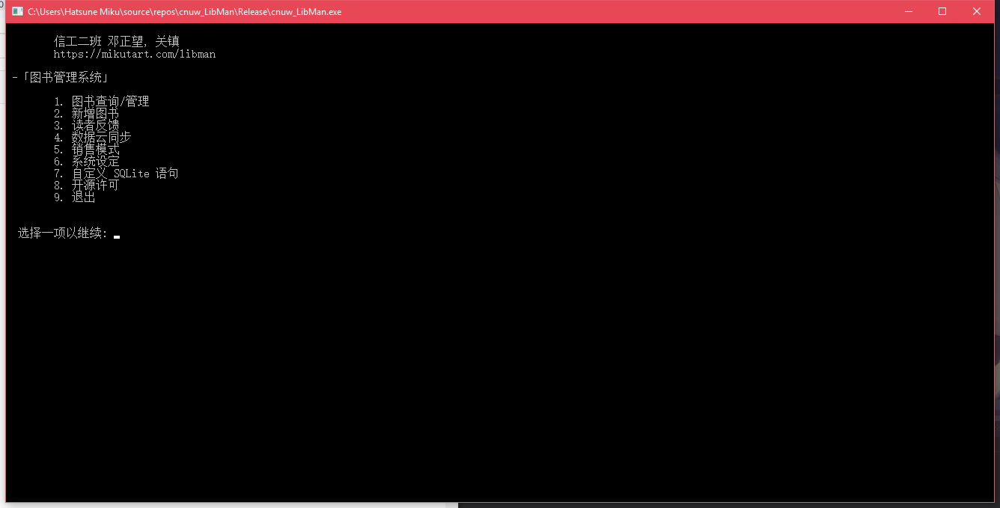
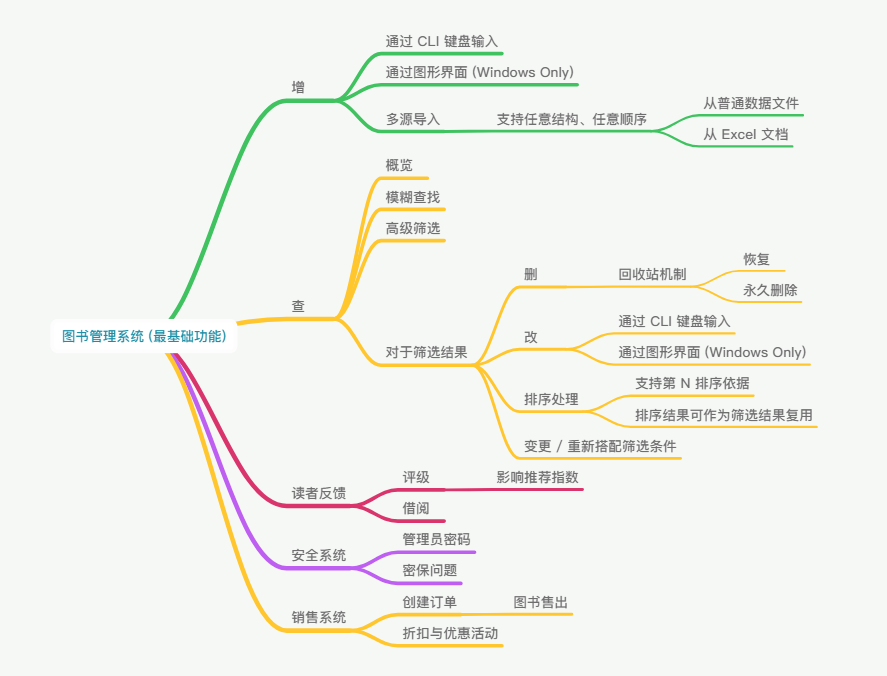

# cnu_library_management
CNU程序设计大作业 - 图书管理系统

binary目录是编译好的成品
source和include目录分别是源文件和头文件
source里面还包含了用到的库的lib
如果需要自行编译，也提供了CMakeLists可以使用

## 主要功能
+ 上学期大作业要求的全部功能
+ 密码找回机制
+ 高级筛选/模糊搜索
+ 数据云同步
+ 回收站机制
+ 销售模式
+ 一些图形界面
+ ~~一键删库~~

## 特点
+ SQLite数据库
+ AES256加密
+ 可编程性
+ 多语言支持
+ Linux兼容
+ 通过了百万条数据的压力测试
+ 难看的界面
+ 可能还有一点别的吧

## 尚未实现
+ 多用户管理

## License
见README.pdf
